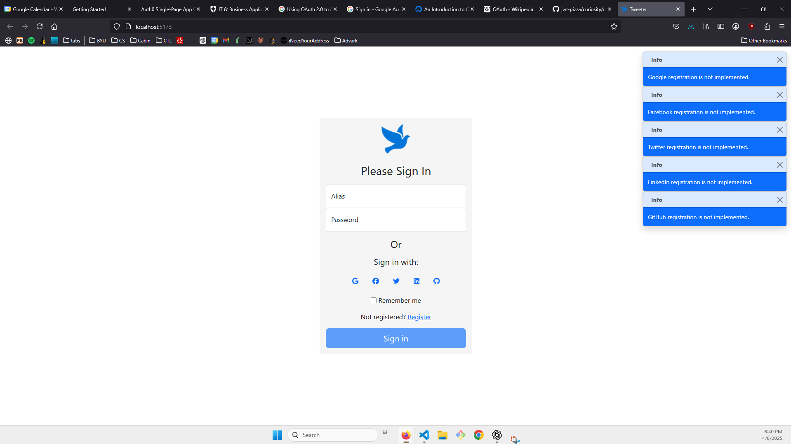

# Curiosity Report - Ian Robertson CS 329 W25

## OAuth

### [What is it?](https://en.wikipedia.org/wiki/OAuth)
- Standard protocol for cross application data sharing.
- Allows for websites to share information without sharing passwords. 
- Allows for integrations between websites and third party applications. 

### [How It Works](https://www.digitalocean.com/community/tutorials/an-introduction-to-oauth-2)

There are four roles for OAuth
1. Resource Owner: User who authorizes an application to access their account. 
2. Client: Application that wants to access the user's account
3. Resource Server: Hosts the protected user accounts
4. Authorization Server: Verifes the identity of the user, issues access tokens to the application

> **Authentication Flow** How the OAuth authentication flow works. 


Once the client gets the access token, it lets them securely access data from the resource server. An example of this could be someone signing up for a service using their GitHub account. This allows the service to access some of the users data from GitHub without sharing passwords, which opens up major security risks. 


### Auth0
Auth0 is a platform created by Okta that allows for quick integration with third party applications. 

I read through the [instructions](https://auth0.com/docs/quickstart/spa/react/interactive) for integrating Auth0 into a React application. 

#### Auth0 SDK
They have an Auth0 SDK that can be easily installed with npm and allows for quick integrations for things like Login. 

```bash
npm install @auth0/auth0-react
```

In this example, The Auth0 provider is given credentials, and a redirect URI. This URI is used as the callback once the the user has been authenticated. This provider is placed at the root of the project to provide context when Auth0 SDK functions are used. 

```javascript
import React from 'react';
import { createRoot } from 'react-dom/client';
import { Auth0Provider } from '@auth0/auth0-react';
import App from './App';

const root = createRoot(document.getElementById('root'));

root.render(
<Auth0Provider
    domain="dev-g5bb0cnru2c3lazg.us.auth0.com"
    clientId="HWO6sqNw7tHcT3SGY3g7IkikzEs5HMxn"
    authorizationParams={{
      redirect_uri: window.location.origin
    }}
  >
    <App />
  </Auth0Provider>,
);
```

#### Example Login Authentication
This example code allows for a user to login using the Auth0 universal login page. This lets you sign in to different accounts or authorize access to the app that redirected you. 
```javascript
import { useAuth0 } from "@auth0/auth0-react";
import React from "react";

const LoginButton = () => {
  const { loginWithRedirect } = useAuth0();

  return <button onClick={() => loginWithRedirect()}>Log In</button>;
};

export default LoginButton;
```


The universal login lets you add custom branding for your organization and provide options for third party integrations. 

#### [Auth0 Marketplace](https://marketplace.auth0.com/)
Auth0 implements the OAuth specification but also allows for many integrations with other services in their Marketplace. Using Auth0 allows for all the user and authorization functionality of a app to be streamlined through their service and easily integratable with third party services. 

The most obvious integration is [social logins](https://marketplace.auth0.com/categories/social-login), Auth0 has integrations for many common integrations.

### Google OAuth 2.0 Playground
A common use case for Oauth is integrating with Google products. Google provides an [interactive playground](https://developers.google.com/oauthplayground/) that lets users see how OAuth can be integrated with many different google APIs such as advertising, google drive suit, etc. 

#### To use OAuth 2.0 with google
1. Obtain OAuth 2.0 credentials from the Google API Console
2. Obtain an access token from the Google Authorization Server
3. Examine scopes of access granted by the user
4. Send the access token to an API.


### CS 340 - Tweeter
In the tweeter project in CS340, one of the parts of the app is the Login page. The login page has icons indicating that a user could use social logins to register for the service, but these icons are lies! Tweeter does not support this feature. I am going to explore how I could integrate social logins using Auth0. 



#### How it would work
1. Register your app with Auth0

Doing this lets you get the important credentials shown in the Auth0 provider code snippet above. Then you would provide your sites name as the callback function. In 340, tweeter is not deployed, but following DevOps principles, we could very easily host it even on something like GitHub pages since it uses lambda and is serverless. 

2. Enable Social Connections

This is the kind of tedious part. I wonder if there is a way to automate this process. You need to choose the social providers you want to integrate with Auth0, then follow instructions to obtain an **App ID** an **App Secret** for each provider. 

You have to manually go through each app integration to obtain these credentials and then place them into Auth0 where they handle the authentication flow. I wonder if there is a way to automate this!

3. Enable Login response in the app

Using the login code snippet and the proper authentications, it will open the univesal login page for Auth0 and once signed in the user will be redirected to the callback provided for tweeter. 

then you can use a react hook to get the user. 

```javascript
const { loginWithRedirect, user, isAuthenticated } = useAuth0();
```

4. Store the user info in DynamoDB
The user data from the hook represents a UserDto in the tweeter app. 

``` typescript
export interface UserDto {
    readonly firstName: string, 
    readonly lastName: string,
    readonly alias: string,
    readonly imageUrl: string,
}
```

We can then create a new user in the user table without requiring a password. This would require some adjustments with the current auth flow that tweeter uses. 

A cool thing that Auth0 provides is an [actions](https://auth0.com/docs/customize/actions) scripting option. These provide scripts that can run automaticlly when a user logins using Auth0. There could be an integration that automatically accesses DynamoDB and S3 when the login occurs. 
