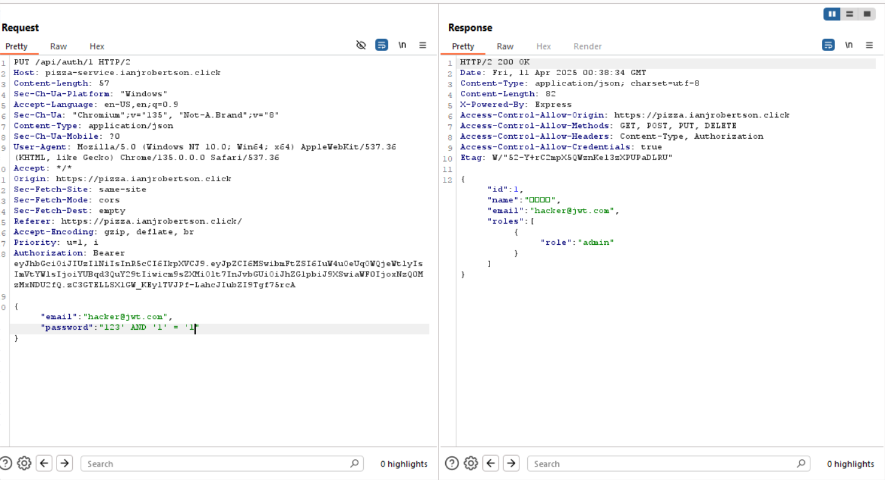
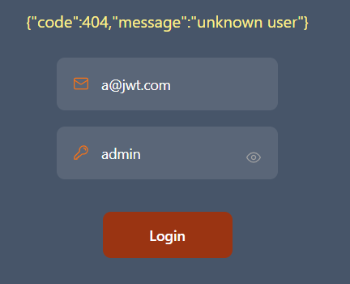
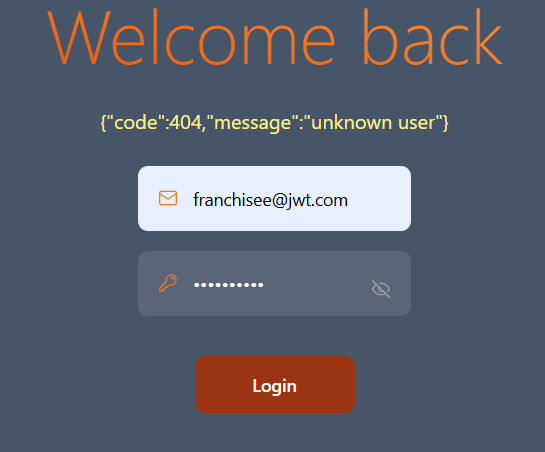
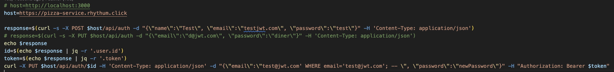
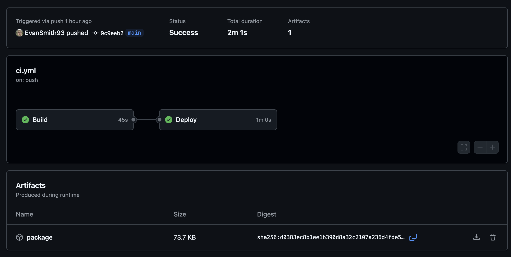
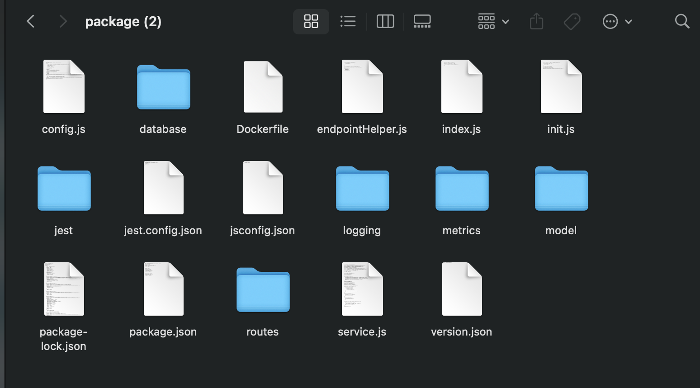
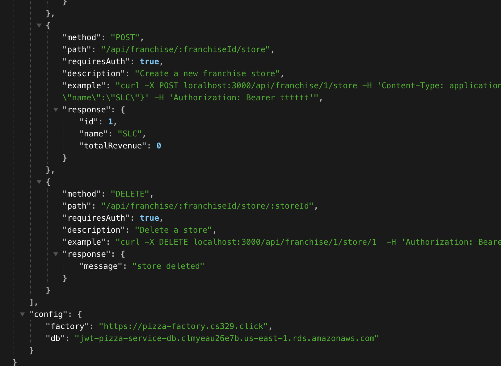
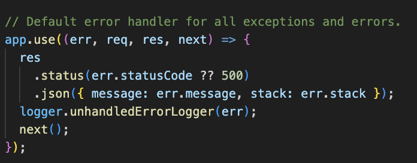
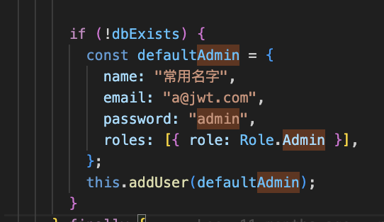

# Penetration testing report

## Names

Ian Robertson and Evan Smith.

## Self Attacks

### Ian Robertson

| Item           | Result                                                                        |
| -------------- | ----------------------------------------------------------------------------- |
| Date           | April 10, 2025                                                                |
| Target         | pizza.ianjrobertson.click                                                     |
| Classification | Injection                                                                     |
| Severity       | 1                                                                             |
| Description    | SQL injection possible through the updateUser endpoint and the password field |
| Images         |                                                      |
| Corrections    | Sanitize user inputs.                                                         |

| Item           | Result                                                                                                                                                                           |
| -------------- | -------------------------------------------------------------------------------------------------------------------------------------------------------------------------------- |
| Date           | April 12, 2025                                                                                                                                                                   |
| Target         | pizza.ianjrobertson.click                                                                                                                                                        |
| Classification | Broken Access Control                                                                                                                                                            |
| Severity       | 3                                                                                                                                                                                |
| Description    | Sign in using the admin jwt pizza account, then you can call updateUser and lock the admin out of the system, then the only way to create another admin is to reset the database |
| Images         |                                                                                                                                                         |
| Corrections    | Just delete the updateUser endpoint. It is never called anywhere else                                                                                                            |

| Item           | Result                                                                                                                                                                                  |
| -------------- | --------------------------------------------------------------------------------------------------------------------------------------------------------------------------------------- |
| Date           | April 12, 2025                                                                                                                                                                          |
| Target         | pizza.ianjrobertson.click                                                                                                                                                               |
| Classification | Broken Access Control                                                                                                                                                                   |
| Severity       | 3                                                                                                                                                                                       |
| Description    | Register a user, update your email to be the email of a known user (a@jwt.com, franchisee@jwt.com, diner@jwt.com). Then change your email back. Will corrupt the email for other users. |
| Images         |                                                                                                                                                                  |
| Corrections    | Just delete the updateUser endpoint. It is never called anywhere else                                                                                                                   |

### Evan Smith

| Item           | Result                                                                                                                                                                                          |
| -------------- | ----------------------------------------------------------------------------------------------------------------------------------------------------------------------------------------------- |
| Date           | Apr 12, 2025                                                                                                                                                                                    |
| Target         | pizza-service.rhythum.click                                                                                                                                                                     |
| Classification | Injection                                                                                                                                                                                       |
| Severity       | 1                                                                                                                                                                                               |
| Description    | SQL injection attack. I was able to change a user's password without knowing their original password. If I know the email of an admin user I could change their password and gain admin access. |
| Images         |  <br/> Script for doing the injection attack.                                                                                                              |
| Corrections    | Sanitize user inputs on the update user endpoint.                                                                                                                                               |

---

| Item           | Result                                                                                                                                                                                                                                      |
| -------------- | ------------------------------------------------------------------------------------------------------------------------------------------------------------------------------------------------------------------------------------------- |
| Date           | Apr 12, 2025                                                                                                                                                                                                                                |
| Target         | pizza-service.rhythum.click                                                                                                                                                                                                                 |
| Classification | Exposed secrets                                                                                                                                                                                                                             |
| Severity       | 1                                                                                                                                                                                                                                           |
| Description    | When the GitHub actions ci pipeline uploads a package, it is publicly accessible within GitHub. Because my repo is public, anyone can access this package. The package contains the production config.js file, which contains many secrets. |
| Images         |  <br/> The GitHub action with a package download option. </br>  <br/> The downloaded package folder (with config.js).                                         |
| Corrections    | Delete the config.js file just before uploading the package in the build stage. Then recreate the config.js file in the deploy stage of the ci pipeline.                                                                                    |

---

| Item           | Result                                                                                                                                                                                                                                                                                                                              |
| -------------- | ----------------------------------------------------------------------------------------------------------------------------------------------------------------------------------------------------------------------------------------------------------------------------------------------------------------------------------- |
| Date           | Apr 12, 2025                                                                                                                                                                                                                                                                                                                        |
| Target         | pizza-service.rhythum.click                                                                                                                                                                                                                                                                                                         |
| Classification | Exposed secrets                                                                                                                                                                                                                                                                                                                     |
| Severity       | 3                                                                                                                                                                                                                                                                                                                                   |
| Description    | The backend endpoint for the docs page returns relevant information for the docs page. However, it also returns the database URL. This is not used within the docs page and should be kept a secret. I do not know of any specific attacks that could come from this alone, however it's not a good idea to leak secrets like this. |
| Images         |  Part of the JSON response for the docs page (including config.db which should be kept secret).                                                                                                                                                                           |
| Corrections    | Do not return the database URL in the docs response.                                                                                                                                                                                                                                                                                |

---

| Item           | Result                                                                                                                                                                                                                                                                                                                                                                                                     |
| -------------- | ---------------------------------------------------------------------------------------------------------------------------------------------------------------------------------------------------------------------------------------------------------------------------------------------------------------------------------------------------------------------------------------------------------- |
| Date           | Apr 12, 2025                                                                                                                                                                                                                                                                                                                                                                                               |
| Target         | pizza-service.rhythum.click                                                                                                                                                                                                                                                                                                                                                                                |
| Classification | Leaked information                                                                                                                                                                                                                                                                                                                                                                                         |
| Severity       | 3                                                                                                                                                                                                                                                                                                                                                                                                          |
| Description    | When an unhandled error occurs within the app, the stack trace is returned to the user. While this is not a specific attack in and of itself, it could make it much easier for an attacker to find vulnerabilities because they can tell what's happening within the system. For instance, I noticed the stack trace for an incorrect login was different depending on whether the email was a valid user. |
| Images         |  <br/> This is the code that returns the error message, along with the stack trace to the user.                                                                                                                                                                                                                                                        |
| Corrections    | Either only return the stack trace when not in the development environment or don't return it at all.                                                                                                                                                                                                                                                                                                      |

---

| Item           | Result                                                                                                                                                                                                                                                                                                                                                                                |
| -------------- | ------------------------------------------------------------------------------------------------------------------------------------------------------------------------------------------------------------------------------------------------------------------------------------------------------------------------------------------------------------------------------------- |
| Date           | Apr 12, 2025                                                                                                                                                                                                                                                                                                                                                                          |
| Target         | pizza-service.rhythum.click                                                                                                                                                                                                                                                                                                                                                           |
| Classification | Misconfigured credentials                                                                                                                                                                                                                                                                                                                                                             |
| Severity       | 1                                                                                                                                                                                                                                                                                                                                                                                     |
| Description    | When the database is initialized, an admin user is automatically created with a default username and password. The password is "admin", which is an easy to guess password. This allows anyone to easily guess the password and log in as an admin. In addition, anyone who looks at the code (since the code is public on GitHub) will be able to tell what the default password is. |
| Images         |  <br/> This is the code that sets the default admin user. The password is insecure and is visible to anyone who looks at the code.                                                                                                                                                                                       |
| Corrections    | Store the default admin password (and possibly also the username) within environment variables both locally and in production. Ensure that the password is something harder to guess.                                                                                                                                                                                                 |
## Peer Attacks

### Ian attacking Evan

#### SQL Injection attack

For my attack, I first tried to perform my SQL injection attacks using the update user endpoint. None of my attacks worked. I tried to drop the user, franchise, menu tables. But my attacks only renamed the emails to be things like `fake@jwt.com'; DROP TABLE user; -- `. I expected this exploit to work, but Evan had found it and patched the issue by using SQL parameterization on the query.

> Code I was trying to exploit

```javascript
if (email) {
  params.push(`email='${email}'`);
}
```

> Evans secure code

```javascript
if (email) {
  params.push(`email=?`);
  values.push(email);
}
```

#### Broken Access Control attack

For this attack, I tried to corrupt and log out users by changing the email address of a known user to to a created user. I thought this exploit was working on my system, but it was likely just a side effect of the previous test. The emails I thought I was changing like `d@jwt.com` probably didn't exist in the database because I had already changed them to `d@jwt.com'; DROP TABLE user; --`, the the email was available in the table.

Overall it was an unsuccessful (or very successful) penetration test.

### Evan attacking Ian

The first thing I tried was to log into his system using the default credentials (username of a@jwt.com and password of admin). However, no such user existed. I could tell that a@jwt.com didn't exist because of the error's stack trace.

I was going to attempt my SQL injection attack, however I noticed by looking at his repository that he had removed the updateUser endpoint, which is the only endpoint I found that was vulnerable to SQL injection. So, this was no longer an option.

On his fork of the jwt-pizza-service repository, I went to his GitHub actions. Under the latest successful pipeline run, I downloaded the package. Contained within it was the config.js file with many of his credentials. I tried several things with these credentials.

I attempted to connect to his database using the database URL and password. However, he had public access to the database disabled, which prevented me from connecting.

With his JWT secret, I tried to sign a JWT token saying I was an admin user. However, in addition to the app using a JWT secret, it also checks to see if the token was in the database. This meant I would need to know what user he was currently signed in as, and recreate his exact same JWT token. Since I did not know the email for any admin users, I was unable to do this.

I spent a while trying to guess an email for an admin user, in hopes I could combine this with the JWT secret to gain admin access. I would try and log in with various emails and checked the error stack trace to see whether or not the email was correct. I tried several variations on a@jwt.com, such as admin@jwt.com and a@test.com. I also looked through his code to see what default emails he used while testing, in hopes he used the same ones for production. Finally, I tried using his BYU email. None of these ended up working. I learned later that he accidentally renamed his admin user's email when attempting a SQL injection attack.

Finally, I had his Grafana metrics and logging API keys. I created a script to repeatedly send metrics reporting large latencies to his Grafana account. I used code from his jwt-pizza-service repository to ensure that it was in the correct format. On my end, it looked like the fake metrics were sending correctly. However, I checked with him afterwards and he didn't see any change on his metrics dashboard. With more time, I likely could've gotten this attack working.

In the end, I was not able to attack his system in any way (other than gaining access to various secrets). For that reason, I did not create any attack records.

## Combined Learning Summary

- AWS and other popular tools are really secure. We didn't find a lot of exploits. Most software that is released commercially has to be very secure. I think this shows the value of paying for commercial software. It is going to be fairly secure, and you don't have to stress over some of the details.
- Having a really solid method for authentication is critical. From our perspective, the JWT pizza code did fairly well at securing things. For things like authentication and data, it is a lot safer to pay someone like AWS to handle/store those things.
- Developing with a security mindset. We both looked through the list of most common attacks. That list contained things we weren't aware was possible, and simply just understanding these attacks helps us have a clearer picture of how to develop good code. Without this knowledge, it's very easy to miss a detail and introduce a big vulnerability.
- It would've been better to have a dedicated penetration testing environment, similar to how unit tests work in our ci pipeline. We both messed up our production systems when trying to do penetration testing on ourselves.
- Hackers are really good at what they do. They have to understand everything at a very low level.
- It's harder to see if the backend is broken or misconfigured since it lacks visuals. You could be accidentally returning things or allowing things and not realize it for a long time.
- Having your code publicly available can make it easier for people to attack you because they're able to find exploits easier. You should design your system to be secure even if attackers can look at your code or your pipelines. The GitHub Actions pipeline let anyone download the artifacts which contained secrets in there. You have to think about security beyond just the code.
